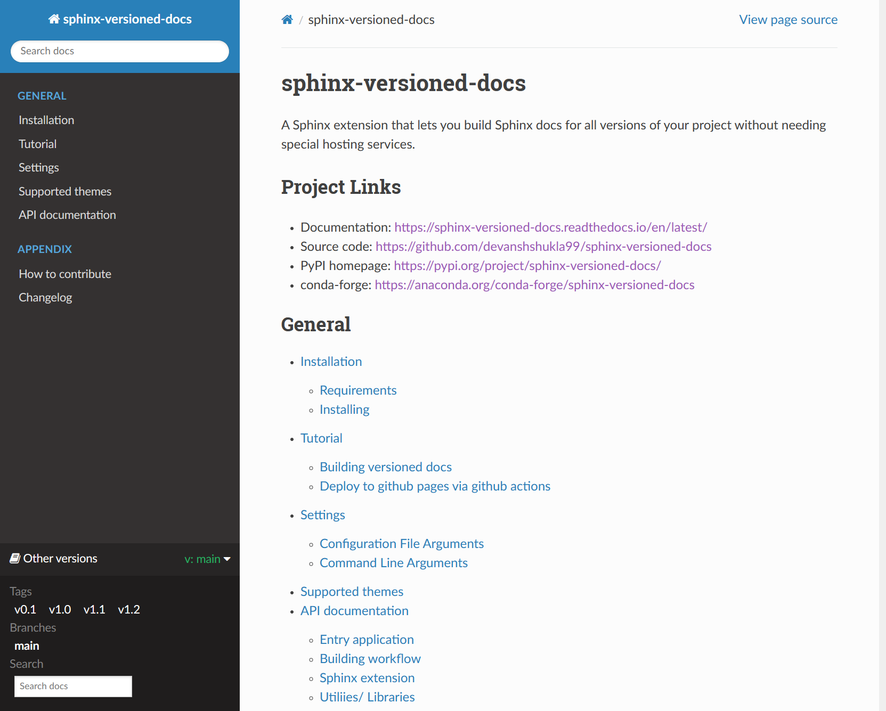

=====================
sphinx-versioned-docs
=====================

Sphinx extension that allows building versioned docs for self-hosting.

It works by producing docs for all(specified) branches in separate folders and injects a readthedocs-like version selector menu/badge.

This project is a fork of `Smile-SA/sphinx-versions <https://github.com/Smile-SA/sphinx-versions>`_ with significant changes.

Get started using the `documentation`_

sphinx-versioned-docs in action!
--------------------------------

How to use
==========

.. code:: bash

    sphinx-versioned --help

.. code:: console

    Usage: sphinx-versioned [OPTIONS]

    Create sphinx documentation with a version selector menu.

╭─ Options ────────────────────────────────────────────────────────────────────────────────────────────────────────────────────────────────────────────────╮
│ --chdir                                             TEXT  Make this the current working directory before running.                                        │
│ --output                -o                          TEXT  Output directory. [default: docs/_build]                                                       │
│ --git-root                                          TEXT  Path to directory in the local repo. Default is CWD.                                           │
│ --local-conf                                        TEXT  Path to conf.py for sphinx-versions to read config from. [default: docs/conf.py]               │
│ --reset-intersphinx     -rI                               Reset intersphinx mapping; acts as a patch for issue #17                                       │
│ --sphinx-compatibility  -Sc                               Adds compatibility for older sphinx versions by monkey patching certain functions.             │
│ --prebuild                   --no-prebuild                Pre-builds the documentations; Use `--no-prebuild` to half the runtime. [default: prebuild]    │
│ --branch                -b                          TEXT  Build documentation for specific branches and tags.                                            │
│ --branch-regex                                      TEXT  Build documentation for specific branches and tags, matched by provided regex                  │
│ --main-branch           -m                          TEXT  Main branch to which the top-level `index.html` redirects to. Defaults to `main`.              │
│                                                           [default: (main)]                                                                              │
│ --floating-badge             --no-floating-badge          Turns the version selector menu into a floating badge. [default: no-floating-badge]            │
│ --quite                      --no-quite                   Silent `sphinx`. Use `--no-quite` to get build output from `sphinx`. [default: quite]          │
│ --verbose               -v                                Passed directly to sphinx. Specify more than once for more logging in sphinx.                  │
│ --log                                               TEXT  Provide logging level. Example --log debug [default: info]                                     │
│ --force                                                   Force branch selection. Use this option to build detached head/commits. [Default: False]       │
│ --cache                                             TEXT  Path to directory with previously build versioned docs. The builder will use it, to avoid      │
│                                                           rebuilding valid versions                                                                      │
│ --help                                                    Show this message and exit.                                                                    │
╰──────────────────────────────────────────────────────────────────────────────────────────────────────────────────────────────────────────────────────────╯
